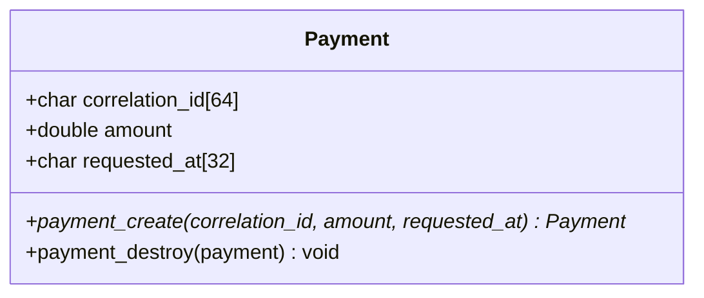
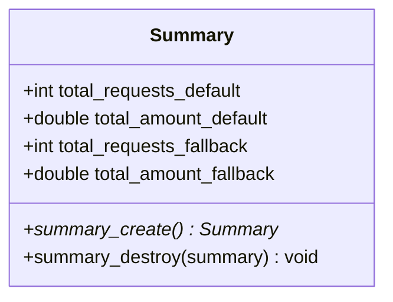
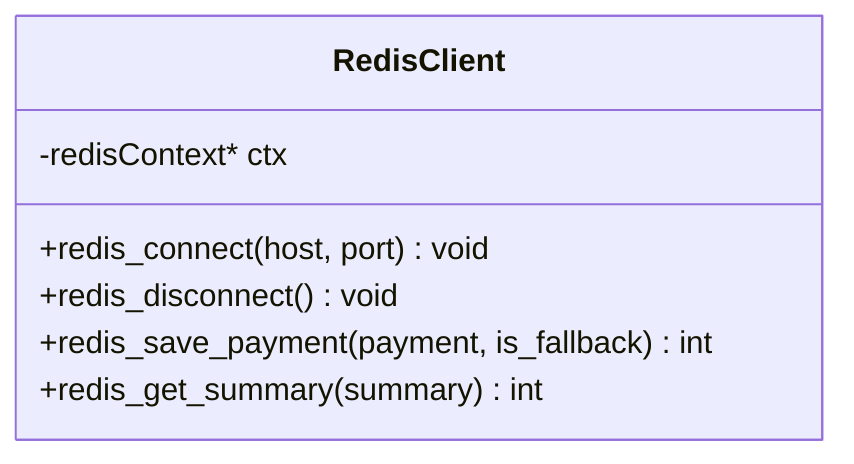
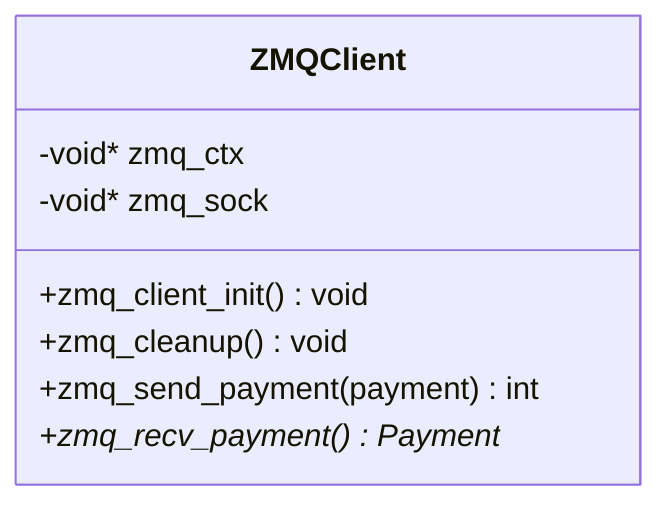
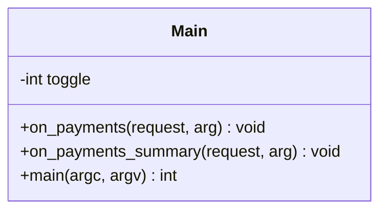
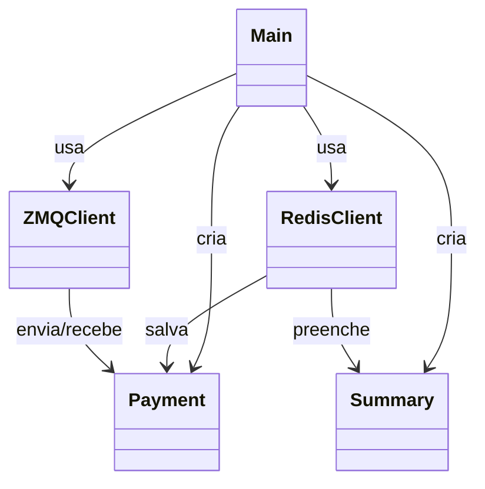

# Diagrama de Classes - Rinha C Backend

## 1. Classe Payment

**Descrição:** Representa um pagamento com ID único, valor e timestamp.

---

## 2. Classe Summary

**Descrição:** Agrega estatísticas de pagamentos por tipo (default/fallback).

---

## 3. Classe RedisClient

**Descrição:** Gerencia conexão e operações com Redis (persistência).

---

## 4. Classe ZMQClient

**Descrição:** Gerencia fila assíncrona para mensageria entre componentes.

---

## 5. Classe Main (HTTP Server)

**Descrição:** Servidor HTTP principal com handlers para endpoints.

---

## Relacionamentos

